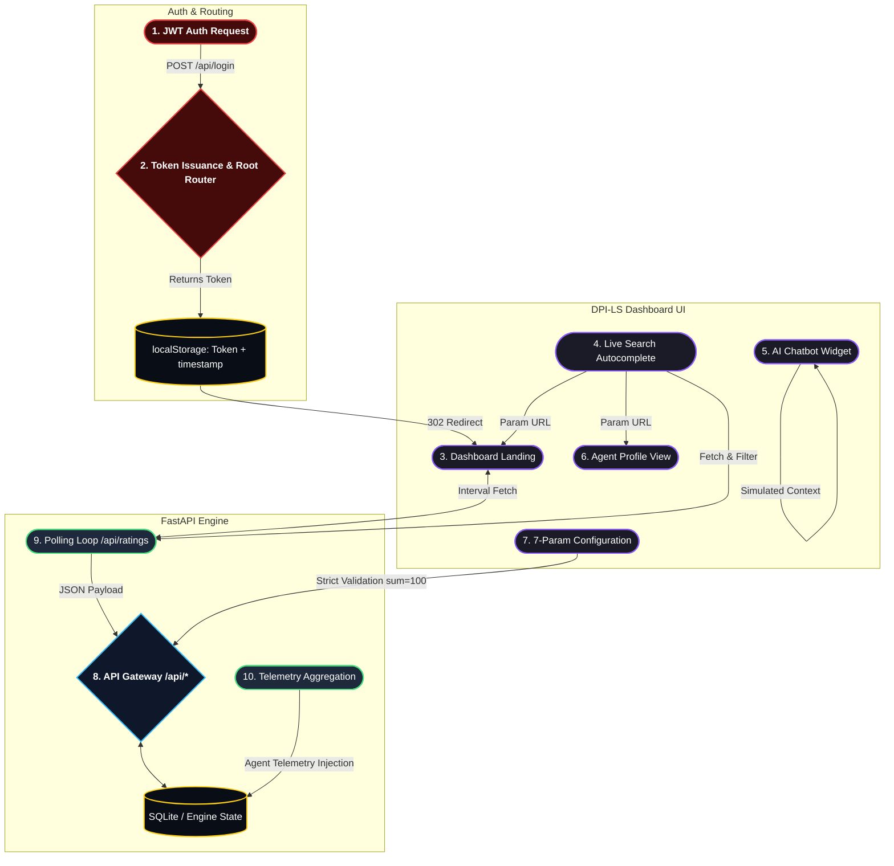

<div align="center">

# DPI-LS Technical Architecture & Implementation Documentation

<p align="center">A comprehensive enterprise-grade technical solution by Intelligenz IT.</p>

<p align="center">
<a href="https://intelligenzit.com/"></a>
<a href="https://www.linkedin.com/company/intelligenz-it/"></a>
</p>

</div>

---

## Technical Overview

The DPI-LS platform is an agent-agnostic evaluation engine and observability dashboard built on a FastAPI Python backend with a vanilla JavaScript/HTML frontend. It leverages an event-driven architecture to compute a 7-dimensional heuristic matrix based on raw telemetry data pushed from AI agents.

## Recent Technical Upgrades (Frontend & Widget UI)

The widget platform has undergone a major **UI/UX and Technical Architecture Overhaul** to transition the application into a dark-themed, enterprise-ready dashboard with enhanced AI features.

### 1. Universal Layout & Routing
* **Dark Theme Standard**: Deprecated old color schemes in favor of a unified `#090d16` and `#0f172a` deep-space dark theme across all 7 views.
* **Unified Sidebar Navigation**: Reordered and strictly locked the sidebar navigation exactly as requested: `Dashboard` (Default Landing) -> `Onboard Agent` -> `Configuration` -> `Rating` -> `Profile` -> `Resources` -> `Sign Out`.
* **Login Tracker**: Embedded a persistent session tracker securely bound to `localStorage` during the `/widget/admin-login.html` authentication step. The `Session Started` badge renders dynamically in the header of all pages.

### 2. Intelligent Search & Autocomplete
* **Global Search Component**: Added a persistent top header with a search bar.
* **Live Autocomplete**: Injected a vanilla JS event-driven listener to the search bar. Typing instantly triggers an async fetch to `/api/ratings`, filtering and categorizing results live into `Agents` and `Metrics`.
* **Deep Linking**: Clickable autocomplete dropdown results route the user instantly to heavily parameterized URLs (e.g. `agent-profile.html?id=chandra-finops` or `demo.html?filter=risk`).

### 3. Native AI Chatbot Integration
* **Floating Assistant**: Injected an absolute-positioned floating action button (FAB) bound to a slide-up conversational interface.
* **Context-Aware Responses**: Bound to a simulated logic engine that provides immediate explanations for complex topics like the DPI-LS algorithm, Risk thresholds, and Weightages.
* **Typewriter Effect**: AI responses use a `setInterval`-based streaming character renderer to simulate natural language generation block-by-block.

### 4. Dynamic Metric Visualization
* **Conditional Score Rendering**: Re-wrote the inner polling loop in `dpi-ls.js` to dynamically inject inline CSS colors to the final DPI-LS score cells.
  * Score >= 80: **Green**
  * Score 51 - 79: **Yellow**
  * Score <= 50: **Red**
* **Strict Configuration Constraints**: Overhauled the `agent-config.html` UI to accept all 7 specific dimensions (P, Q, E, G, R, C, V). Added hard validation logic ensuring weight distribution equals exactly 100% prior to dispatching `Promise.all` fetch payloads to the backend.

### 5. Backend Alignment
* **Test Suite Modernization**: Re-wired `tests/test_widget_serving.py` to correctly test the new requirement that unauthenticated root (`/`) visitors are routed strictly to `admin-login.html` instead of the Dashboard.

## Technical Architecture

The updated end-to-end technical workflow, reflecting the removal of deprecated features (KRA/Customer Feedback) and the introduction of the new global utilities (Search/Chatbot), follows this architecture:



## AI Agent Integration Model

The engine is **agent-agnostic**. It exposes webhooks and REST endpoints that consume a canonical `AgentObservation` JSON schema.
Supported integrations via `POST /api/metrics/export`:
- OpenAI Agents SDK
- LangGraph, LangChain, CrewAI, AutoGen, LlamaIndex
- Raw HTTP telemetry pushes

## Deployment

Deploy using Uvicorn (Development) or Docker Compose (Production):
```bash
uv run uvicorn api.app:app --host 0.0.0.0 --port 8000
```
```bash
docker compose up -d
```

## About Intelligenz IT

Website: https://intelligenzit.com/  
LinkedIn: https://www.linkedin.com/company/intelligenz-it/
