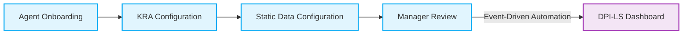

<div align="center">


<p align="center">A comprehensive enterprise-grade solution by Intelligenz IT.</p>

<p align="center">
<a href="https://intelligenzit.com/"></a>
<a href="https://intelligenzit.com/"></a>
<a href="https://www.linkedin.com/company/intelligenz-it/"></a>
<a href="http://54.160.31.20:3000/onboarding"></a>
<a href="https://intelligenzit.com/"></a>
</p>

<p align="center">
<a href="#quick-start"><b>Quick Start</b></a> • <a href="#architecture"><b>Architecture</b></a> • <a href="#dashboard"><b>Dashboard</b></a> • <a href="#the-7-dimensions"><b>The 7 Dimensions</b></a>
</p>

</div>

---

Prepared by Intelligenz IT AI & Automation Center of Excellence

## Quick Start

```bash
uv run uvicorn api.app:app --host 127.0.0.1 --port 8000
```
- **Onboarding:** http://127.0.0.1:8000/widget/onboarding.html
- **Dashboard:** http://127.0.0.1:8000/widget/demo.html
- **API Docs:** http://127.0.0.1:8000/docs

## Business Problem

When companies deploy AI to handle important work — like processing invoices, analyzing medical documents, or monitoring cloud costs — they need to know if the AI is doing a good job, working safely, and actually saving money. The problem is a lack of real-time visibility, governance, and quantifiable metrics on AI behavior.

## Solution Overview

**DPI-LS answers that question.** Instead of just hoping the AI works, DPI-LS automatically measures 7 critical performance areas and gives you a single, easy-to-understand score out of 100. It combines hard data from the AI's operations with subjective feedback from human managers to ensure the AI is truly adding value. 

**We measure Trust, not just Productivity.** By bridging HR, Business, and Compliance, DPI-LS helps organizations manage AI as a workforce — with full lifecycle governance and accountability.

## Architecture

The complete end-to-end workflow follows this architecture:



For detailed architecture diagrams, refer to:
[Architecture](./docs/architecture.png)

## Dashboard

All results flow into the live Dashboard, which serves as your central command center. The Dashboard contains:
- **Leaderboard**: All agents ranked by score.
- **Resources**: Operational manuals and guides.
- **DPI-LS Score Details**: Scoring methodology.
- **Customer Feedback Portal**: End-user feedback forms.

[Dashboard Reference](./docs/dashboard.png)

## KPIs

- **Score Range**: 0-100 arithmetic mean of all dimensions.
- **Exceptional**: 85-100
- **Strong**: 70-84
- **Needs Optimization**: 50-69
- **Underperforming**: Below 50

## The 7 Dimensions

Every AI agent is evaluated across these 7 areas:

| Dimension | What It Measures | In Simple Terms |
|-----------|-----------------|-----------------|
| **P** — Productivity | How much work the AI completes compared to a human | "Is the AI faster than a person?" |
| **Q** — Quality | Accuracy, consistency, and hallucination rate of AI outputs | "Is the AI giving correct answers?" |
| **E** — Execution | Success rate of all AI tasks and tool calls | "Is the AI completing tasks without errors?" |
| **G** — Governance | Policy compliance — PII leaks, unauthorized access | "Is the AI following the rules?" |
| **R** — Risk | Frequency and severity of incidents and exceptions | "Is the AI causing any problems?" |
| **V** — Validation | Whether outputs are properly structured | "Is the AI producing well-formatted results?" |
| **C** — Cost | AI cost per output compared to human cost per output | "Is the AI saving us money?" |

## AI Agent Model

The engine is **agent-agnostic** — it consumes a canonical `AgentObservation` schema and never imports an agent framework. It supports:
- OpenAI Agents SDK
- LangGraph, LangChain, CrewAI, AutoGen, LlamaIndex
- Raw OpenAI / Anthropic
- Any custom framework

## Security & Governance

If the AI fails on Governance (G), Risk (R), or Validation (V), the system automatically caps the score and flags the agent as **Unsafe** — no matter how well it performs in other areas. A single PII leak will trigger this safety gate.

## Deployment

Deploy using Docker Compose for the full observability stack:
```bash
docker compose up -d
```

## References

- [Whitepaper](./docs/whitepaper.pdf)
- [Design Rationale](./CLAUDE.md)
- [License](./LICENSE)

## About Intelligenz IT

Intelligenz IT is a global enterprise transformation partner specializing in:

- AI & Automation
- Microsoft Copilot
- Copilot Studio
- Azure OpenAI
- SAP
- Salesforce
- ServiceNow
- Cloud Transformation
- Data Engineering
- Analytics
- Enterprise Architecture

Website: https://intelligenzit.com/  
LinkedIn: https://www.linkedin.com/company/intelligenz-it/

---

© Intelligenz IT.
All Rights Reserved.

For inquiries:
https://intelligenzit.com/

LinkedIn:
https://www.linkedin.com/company/intelligenz-it/
