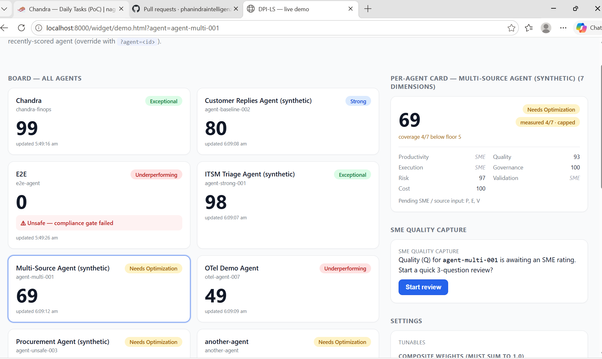
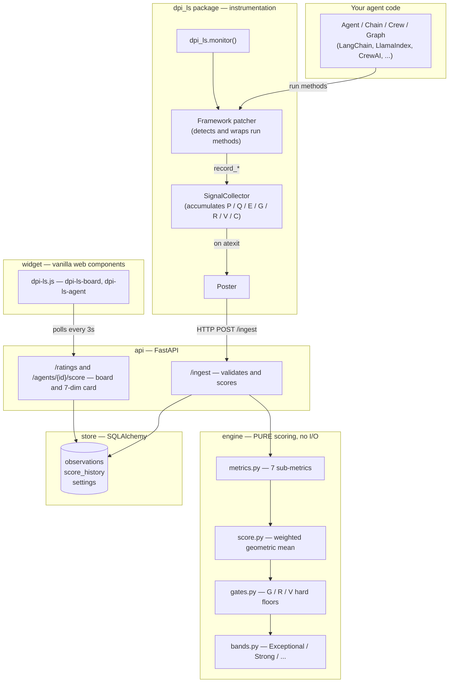
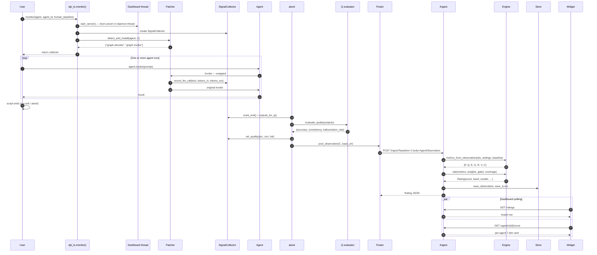
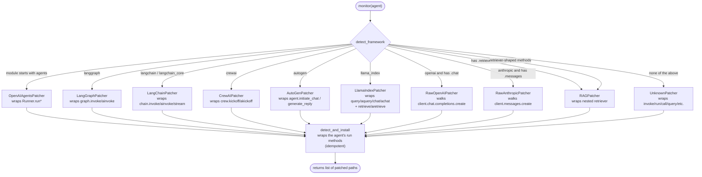
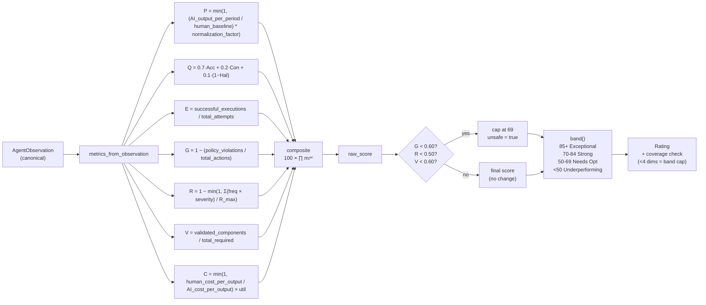
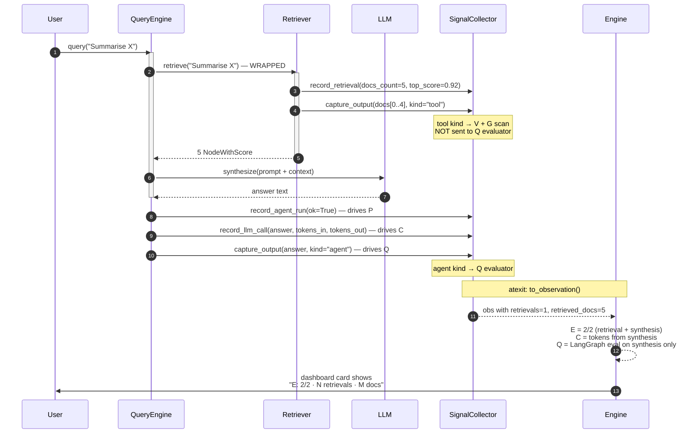
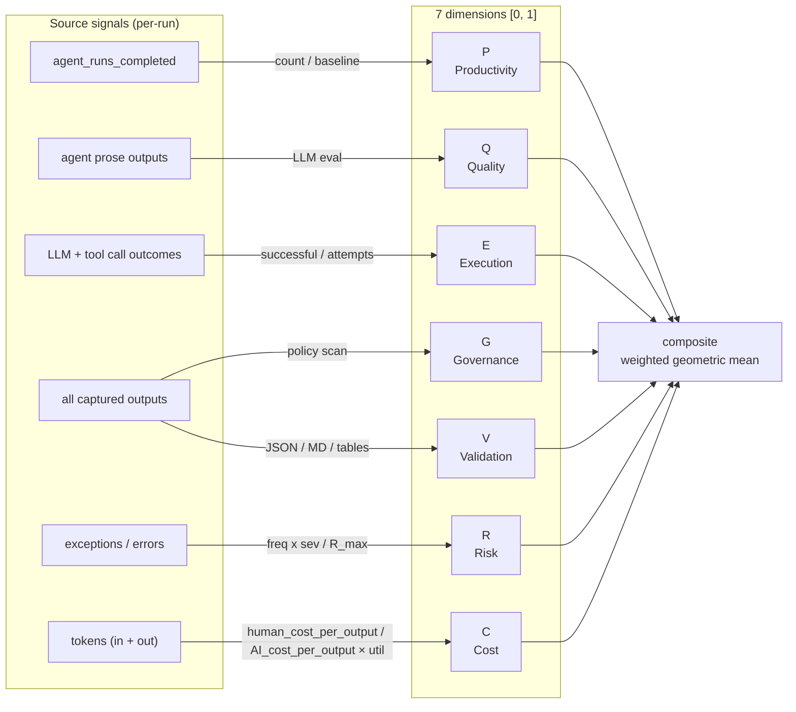

# DPI-LS — Digital FTE Performance Index

> **Score any AI agent in real time on a 0–100 index across 7 performance
> dimensions, with hard compliance gates and a live embeddable dashboard.**

The pitch: *two lines of code — and the agent shows up on a live board,
rated across P, Q, E, G, R, V, C, with safety gates that fire automatically.*

The engine is **agent-agnostic** — it consumes a canonical
`AgentObservation` schema and never imports an agent framework. The
`dpi_ls` instrumentation package wraps a framework's run methods, builds
the observation, and POSTs it to the same engine the REST API uses.
Onboarding a new agent = a new adapter (or a YAML mapping). Never an
engine change.

The design rationale, hard requirements, and the full scoring spec
live in [CLAUDE.md](./CLAUDE.md). This README is the runbook.

## Why DPI-LS

* **One number for the whole agent.** A weighted geometric mean of
  P, Q, E, G, R, V, C — a single score a CFO can quote, with the
  full breakdown on the dashboard.
* **Hard safety gates.** A single PII leak drops the agent to
  "Needs Optimization" with an `unsafe` flag, regardless of how
  strong the other dimensions are. The gates don't soften, and the
  dashboard shows the flag.
* **Coverage-aware.** A C-only agent (just one source feeding) can
  score 90 on its raw C, but the band is held at "Needs Optimization"
  until enough dimensions report. No false "Strong" labels.
* **Framework-agnostic by contract.** A canonical Pydantic schema is
  the only thing the engine ever sees. Adapters translate from
  LangChain, LangGraph, CrewAI, LlamaIndex, AutoGen, raw OpenAI, raw
  Anthropic, or anything with an `invoke` method.
* **Universal fallback.** No adapter? Drop a YAML field mapping in
  `MAPPINGS_DIR` or emit OTel spans — the engine scores the agent
  with zero new code.

---

## Contents

- [Live demo](#live-demo)
- [Quick start](#quick-start)
- [The two-line integration](#the-two-line-integration)
- [The 7 dimensions](#the-7-dimensions)
- [Architecture](#architecture)
  - [System overview](#system-overview)
  - [Project structure](#project-structure)
  - [The two-line flow](#the-two-line-flow)
  - [Framework detection](#framework-detection)
  - [Scoring pipeline](#scoring-pipeline)
  - [RAG signal flow](#rag-signal-flow)
  - [The 7-dimension map](#the-7-dimension-map)
- [The `dpi_ls` package](#the-dpi_ls-package)
- [Framework integration recipes](#framework-integration-recipes)
- [Reading the per-agent card](#reading-the-per-agent-card)
- [Data flow](#data-flow)
- [The DPI-LS score — formula reference](#the-dpi-ls-score--formula-reference)
- [API surface](#api-surface)
- [Onboarding a new agent or source](#onboarding-a-new-agent-or-source)
- [Configuration](#configuration)
- [Running the tests](#running-the-tests)
- [Key implementation notes](#key-implementation-notes)
- [What's intentionally not done](#whats-intentionally-not-done)

## Live demo

This is what `dpi_ls` renders the moment you open `http://localhost:8000/`
after running any of the examples in `examples/`:



The **board** (left) shows one row per scored agent with the composite
score, the band, and a red `unsafe` badge when a compliance gate fired.
The **per-agent card** (right) renders all 7 normalized sub-scores plus
coverage, gate failures, and cap reasons. The **SME quality capture**
panel (bottom-right) lets a subject-matter expert record Q in three
conversational steps.

The widget is one vanilla-JS file (`widget/dpi-ls.js`, ~650 lines) and
embeds into any host page with a single `<script>` tag — no framework,
no build step.

---

## Quick start

Requires **Python 3.11+** and **`uv`** (or `pip`).

### Install as a package

You can install the `dpi_ls` package directly from the repository:

```bash
pip install git+https://github.com/phanindraintelligenzit-afk/widget.git
```

Then, in your code, just import it and call monitor:

```python
import dpi_ls

collector = dpi_ls.monitor(my_agent, agent_id="my-agent", human_baseline=1)
```

### Install for development

```bash
git clone https://github.com/phanindraintelligenzit-afk/widget.git dpi-ls
cd dpi-ls
uv sync                                    # runtime + dev deps
```

### Option A — run the demo dashboard only

```bash
uv run uvicorn api.app:app --host 0.0.0.0 --port 8000
./scripts/demo_seed.sh                     # seeds the board with fixtures
```

Open **http://localhost:8000/** — redirects to `/widget/demo.html`. You
should see the board, per-agent card, and SME quality capture panel
exactly as in the [screenshot above](#live-demo).

### Option B — run an example agent (end-to-end)

```bash
uv run examples/test_agent.py              # needs AWS Bedrock access
```

Starts the dashboard in the background, runs the Chandra FinOps agent,
evaluates Q with the LangGraph LLM evaluator, and POSTs the scored
observation. Expected final score: **95–99 / 100, band: Exceptional**.

---

## The two-line integration

```python
import dpi_ls

collector = dpi_ls.monitor(my_agent, agent_id="my-agent", human_baseline=1)
# ... your existing agent code, completely unchanged ...
```

That's the whole integration. `dpi_ls.monitor()` auto-detects the
framework from the object you pass, installs the matching hooks,
boots the dashboard in a background thread, and on `atexit` POSTs the
final `AgentObservation` to `/ingest` — which the widget renders as
the 7 dimensions on the board. On script exit, `dpi_ls` evaluates Q,
builds the canonical observation, and the dashboard row for
`my-agent` populates within ~3 seconds.

---

## The 7 dimensions

| Dim | What it measures | Source signal | Dashboard card line |
|---|---|---|---|
| **P** — Productivity | `min(1, (AI_output_per_period / human_baseline) * normalization_factor)` | top-level `Runner.run` / `kickoff` / `ainvoke` count | "N completed / baseline M" |
| **Q** — Quality | `0.7·Acc + 0.2·Con + 0.1·(1−Hal)` | LangGraph LLM evaluator on the last N agent prose outputs | "Acc / Con / (1−Hal)" triple |
| **E** — Execution | `successful_executions / total_attempts` | LLM + tool call success rate | "X successful / Y attempts" |
| **G** — Governance | `1 − (policy_violations / total_actions)` | deterministic policy scan (PII, auth errors, secrets, prompt-injection) on every output | "V violations / A actions" |
| **R** — Risk | `1 − min(1, Σ(freq × severity) / R_max)` | recorded exceptions and incidents | "I incidents (ΣW = …)" |
| **V** — Validation | `validated_components / total_required` | JSON / Markdown `##` headers / `<answer>` / `\| tables \|` detector | "V validated / R required" |
| **C** — Cost | `min(1, human_cost_per_output / AI_cost_per_output) × utilization` | token counts from `response.usage` / `usage_metadata` / your `record_llm_call` | "T tokens · $X" |
| **RAG signals** *(informational)* | `retrievals` count + total docs retrieved | RAG / LlamaIndex patchers via `record_retrieval` | "N retrievals · M docs" (under E) |

**Composite — weighted geometric mean:**

```
DPI-LS = 100 × ( P^0.15 · Q^0.20 · E^0.15 · G^0.20 · R^0.15 · V^0.10 · C^0.05 )
```

**Bands:** `85–100 Exceptional · 70–84 Strong · 50–69 Needs Optimization ·
<50 Underperforming`.

**Hard compliance gates:** if `G < 0.60` OR `R < 0.50` OR `V < 0.60` the
score is **capped at 69** and flagged `unsafe = true` — visible as a
red badge on the board and as a `gate_failures` array on the per-agent
card.

> The full formula reference, including vacuous-safe defaults, the
> completeness cap, and the four spec reference outputs, lives in
> [The DPI-LS score — formula reference](#the-dpi-ls-score--formula-reference) below.

---

## Reading the per-agent card

Click a board row to drill in. The card renders something like:

```
agent_id            chandra-finops
score               96.4 / 100        ← post-gate final
raw_score           96.4              ← pre-gate composite
band                Exceptional
unsafe              false
coverage            7 / 7             ← how many of the 7 dims were measured
gate_failures       []
cap_reasons         []

P — Productivity    1.000   1 run / baseline 1
Q — Quality         0.920   Acc 0.95 · Con 0.90 · (1−Hal) 0.85
E — Execution       1.000   14 successful / 14 attempts
G — Governance      1.000   0 violations / 14 actions
R — Risk            1.000   0 incidents
V — Validation      1.000   14 validated / 14 required
C — Cost            0.850   4 213 tokens · $0.004
```

`missing` and `coverage` are the two fields to watch on a first run:

* `missing` lists dimensions with no signal yet (e.g. `["Q"]` while the
  LangGraph evaluator is still running, or `["C"]` if you didn't push
  tokens).
* `coverage_capped = true` means the band was capped because fewer
  than 4 dimensions were measured (or any of G/R/V is missing) —
  the `cap_reasons` array names the missing ones so you know which
  patcher to add.

Once all 7 dimensions report at least one signal, the card shows the
real composite and the board row stays in its true band.

---

## Architecture

A 30-second tour of the system, the file layout, and the data flow.

### System overview

Five layers, each replaceable. The engine is the only one that
contains scoring math; everything else is plumbing.



**The cardinal rule:** the engine consumes only `AgentObservation`. It
never imports a framework. Adapters, ingest endpoints, and the
instrumentation package are the only things that know about agent
runtimes.

### Project structure

```
dpi-ls/
├── contract/         Pydantic models — the canonical AgentObservation (the only schema)
│   ├── models.py     AgentObservation, Quality, Cost, Policy, Validation, Executions
│   ├── partial.py    PartialObservation — one dimension at a time, merged by the API
│   ├── rating.py     Rating — the engine's output (score, band, gates, metrics)
│   └── settings.py   Tunables (weights, gate thresholds, R_max, human cost/hr)
│
├── engine/           PURE scoring. No I/O. No framework imports. The source of truth.
│   ├── metrics.py    compute_P, Q, E, G, R, V, C  → 7 normalized [0, 1] sub-metrics
│   ├── score.py      composite() — weighted geometric mean × 100
│   ├── gates.py      gate_check() — G/R/V compliance floors; cap at 69 if any fire
│   ├── bands.py      band() — Exceptional / Strong / Needs Optimization / Underperforming
│   └── sme_flow.py   Conversational Q-capture state machine
│
├── ingestion/        Adapters — the only place that knows about agent runtimes
│   ├── base.py       Adapter interface + to_observations() contract
│   ├── registry.py   Name → adapter lookup
│   ├── generic/      Universal adapters (work for any agent)
│   │   ├── webhook.py     GenericWebhookAdapter — POST any JSON
│   │   ├── mapping.py     YAML field-mapping for arbitrary payloads
│   │   ├── otel.py        OpenTelemetry spans → observation
│   │   └── jsonpath.py    JSONPath resolution for the YAML mapping
│   └── sources/      Per-system partial-dimension adapters
│       ├── aws_cost.py, puvi_noise.py, arize.py,
│       │   servicenow.py, jira.py, base.py, registry.py
│       └── stubs.py  langgraph, bedrock, ray, bmc, sap_hr (placeholders)
│
├── api/              FastAPI — the demo surface the widget polls
│   ├── app.py        Route handlers (/ingest, /ratings, /agents/{id}/score, /settings, …)
│   ├── scoring.py    score_and_persist() — the bridge between API and engine
│   ├── bootstrap.py  Adapter registration, DB init
│   ├── schemas.py    Request/response models
│   └── sme_orchestration.py  Conversational Q-capture HTTP layer
│
├── store/            SQLAlchemy persistence
│   ├── models.py     AgentRow, ObservationRow, ScoreRow, SettingsRow, PartialRow
│   └── repo.py       upsert_agent, save_observation, save_score, get_settings, …
│
├── dpi_ls/           ⭐ The 2-line installable package
│   ├── __init__.py   Public surface: monitor(), evaluate_quality(), SignalCollector
│   ├── monitor.py    Entry point — framework detection, server boot, atexit finalizer
│   ├── collector.py  SignalCollector — accumulates P/Q/E/G/R/V/C signals
│   ├── evaluator.py  LangGraph Q evaluator (accuracy, consistency, hallucination)
│   ├── heuristics.py Deterministic Q fallback when LLM is unreachable
│   ├── poster.py     post_observation() — POSTs AgentObservation to /ingest
│   ├── server.py     Background uvicorn launcher (idempotent, daemon thread)
│   ├── policy.py     Deterministic G policy scan (PII, secrets, prompt-injection)
│   ├── _state.py     Process-wide collector singleton
│   └── frameworks/   Framework-specific patchers
│       ├── base.py             BasePatcher, _safe_text, _safe_iter_tokens
│       ├── openai_agents.py    OpenAI Agents SDK (Runner.run* + RunHooks)
│       ├── langchain.py        LangChain Runnable/Chain
│       ├── langgraph.py        LangGraph compiled StateGraph
│       ├── crewai.py           CrewAI Crew
│       ├── autogen.py          AutoGen 0.7+ AssistantAgent
│       ├── llama_index.py      LlamaIndex query engine + retriever
│       ├── rag.py              General RAG pattern (retrievers + chains-with-retriever)
│       ├── raw_openai.py       openai.OpenAI / AsyncOpenAI client
│       ├── raw_anthropic.py    anthropic.Anthropic / AsyncAnthropic
│       └── unknown.py          Best-effort fallback (invoke/run/call/…/query)
│
├── widget/           Embeddable dashboard (no framework — drop into any host page)
│   ├── dpi-ls.js     648 lines, vanilla web components
│   └── demo.html     Standalone demo page
│
├── fixtures/         Sample observations + a sample YAML mapping (mock-first dev)
├── examples/         End-to-end demo agents (one per supported framework)
└── tests/            232 tests, < 12 seconds
```

### The two-line flow

From `import dpi_ls` to a row on the dashboard — the full lifecycle in
one sequence.



### Framework detection

Detection is by **module name** (no `isinstance` against concrete
classes — the engine never imports a framework).



**Idempotency:** every patcher marks wrappers with `_dpi_ls_patched`.
Calling `monitor()` twice on the same object is a no-op on the second
call. A second `monitor()` call with a new collector swaps the active
collector via the shared `_dpi_ls_collector_ref` (used by
`UnknownPatcher`, `LlamaIndexPatcher`, and `RAGPatcher`).

### Scoring pipeline

The engine is pure functions over a normalized observation. Nothing
imports an agent framework, nothing calls out to the network.



The `min_dimensions_for_full_band` setting (default 5) prevents an
agent with only one or two reported dimensions from scoring 100 —
the band is capped at *Needs Optimization* until at least 5 of 7
dimensions report a signal.

### RAG signal flow

In a RAG agent, the retriever and the synthesizer do very different
things. The instrumentation treats them separately so the per-agent
card shows what's actually happening.



**Key invariant:** the retriever's returned node text is tagged
`tool`, so the deterministic V / G scanners see it but the Q LLM
evaluator does NOT — raw corpus text would otherwise drown the
evaluator in noise.

### The 7-dimension map



Six of the seven dimensions are computed deterministically in the
collector / engine. **Q is the exception** — it needs an LLM
judge (the `evaluator.py` LangGraph node). When the LLM is
unreachable, the deterministic `heuristics.py` fallback produces a
rough but non-zero Q so the composite doesn't drop one dimension
to "needs input".

---

## The `dpi_ls` package

### `dpi_ls.monitor()` — two-line integration

```python
import dpi_ls

collector = dpi_ls.monitor(
    agent,                    # any supported framework object
    agent_id="chandra-finops",
    agent_name="Chandra FinOps Agent",   # optional
    human_baseline=1,         # outputs a human would produce per period
    post=True,                # POST to /ingest on exit (default)
    open_browser=False,       # pop the dashboard tab
    host="127.0.0.1",
    port=8000,
)
```

**`human_baseline`** is the key parameter for **P (Productivity)**:
- Single-run report agent → `human_baseline=1`
- Batch ticket-processing agent handling 100 tickets → `human_baseline=100`
- Defaults to `100` on first run (stored in the DB per agent)

### `dpi_ls.evaluate_quality()` — explicit Q scoring

```python
from dpi_ls import evaluate_quality

outputs = collector.outputs_for_q()   # returns agent prose outputs only
q = evaluate_quality(outputs)          # runs LangGraph LLM evaluator
collector.set_quality(q.accuracy, q.consistency, q.hallucination_rate)
```

Falls back to a deterministic heuristic if the LLM is unreachable.

### Supported frameworks

| Framework | What you pass to `monitor()` | Auto-patches | C (cost) captured | Example |
|---|---|---|---|---|
| **OpenAI Agents SDK** | `Agent` instance | `Runner.run*` (via injected `RunHooks`) | yes — `response.usage` | `examples/test_agent.py` |
| **LangGraph** | compiled `StateGraph` | `graph.invoke` / `graph.ainvoke` | manual* — see `record_llm_call` | `examples/langgraph_research.py` |
| **LangChain** | `Runnable` / `Chain` | `chain.invoke` / `ainvoke` / `stream` | yes — `usage_metadata` | `examples/langchain_qa.py` |
| **CrewAI** | `Crew` instance | `crew.kickoff` / `akickoff` | manual* | `examples/crewai_research.py` |
| **AutoGen 0.7+** | `AssistantAgent` | `agent.run` (best-effort) | manual* | `examples/autogen_debate.py` |
| **LlamaIndex** | query engine / retriever | `query` / `aquery` / `chat` / `achat` / `retrieve` / `aretrieve` | yes — `response.metadata['usage']` | `examples/llamaindex_rag.py` |
| **RAG (general)** | any retriever, or chain with `.retriever` | `retrieve` / `aretrieve` / `get_relevant_documents` | manual* | below |
| **Raw OpenAI client** | `openai.OpenAI` / `AsyncOpenAI` | `client.chat.completions.create` (walks the client) | yes — `response.usage` | below |
| **Raw Anthropic client** | `anthropic.Anthropic` / `AsyncAnthropic` | `client.messages.create` (walks the client) | yes — `response.usage` | below |
| **Anything else** | any object exposing `invoke` / `run` / `__call__` | best-effort | manual* | `examples/raw_bedrock.py` |

*\* "manual" = the patcher doesn't see the inner LLM call, so push tokens into the collector yourself with one `collector.record_llm_call(text, tokens_in=..., tokens_out=..., cost=...)` inside your LLM wrapper. The framework examples show the exact one-liner.*

**RAG signals.** When a query engine runs a retrieval internally, `dpi_ls` records each retrieval as a tool call (drives E and G via the policy scan) and surfaces `retrievals` + `retrieved_docs_total` on the per-agent card. Retrieved node text is tagged `tool` so it feeds V and G but NOT the Q LLM evaluator (raw corpus text would drown the LLM in noise).

---

## Framework integration recipes

`dpi_ls.monitor(agent, agent_id=...)` is the **single entry point** for every framework. It auto-detects the framework from the object you pass, installs the matching patcher, starts the dashboard in a background thread, and on `atexit` POSTs the final `AgentObservation` to `/ingest` — which the widget then renders as the 7 dimensions on the board.

### The universal 2-line pattern

```python
import dpi_ls

dpi_ls.monitor(my_agent, agent_id="my-agent", human_baseline=1)
# ... your existing agent code, completely unchanged ...
```

That's it. On script exit, `dpi_ls` evaluates Q, builds the canonical observation, and the dashboard row for `my-agent` populates within ~3 s.

### OpenAI Agents SDK

```bash
pip install openai-agents
```

```python
import asyncio
from agents import Agent, Runner
import dpi_ls

agent = Agent(
    name="support-bot",
    instructions="You are a concise customer support agent.",
    model="gpt-4o-mini",
)
dpi_ls.monitor(agent, agent_id="openai-agents-demo", human_baseline=1)

result = asyncio.run(Runner.run(agent, "Summarise my last 3 orders."))
print(result.final_output)
```

`OpenAIAgentsPatcher` injects a `RunHooks` subclass into `Runner.run`,
so **all 7 dimensions light up automatically** — P from the run count,
E from `on_llm_end` / `on_tool_end`, G from the policy scan on every
output, V from the structured-output detector, C from `response.usage`,
Q from the LangGraph evaluator. R increments on exceptions.

### LangGraph

```bash
pip install langgraph langchain-openai
```

```python
from typing import TypedDict
from langgraph.graph import END, StateGraph
from langchain_openai import ChatOpenAI
import dpi_ls

class State(TypedDict):
    question: str
    final_answer: str

def answer(state: State):
    msg = ChatOpenAI(model="gpt-4o-mini").invoke(state["question"])
    return {"final_answer": msg.content}

g = StateGraph(State)
g.add_node("answer", answer)
g.set_entry_point("answer")
g.add_edge("answer", END)
graph = g.compile()

dpi_ls.monitor(graph, agent_id="langgraph-demo", human_baseline=1)
print(graph.invoke({"question": "What is 2+2?"})["final_answer"])
```

LangGraph's patcher wraps `graph.invoke` / `graph.ainvoke` — P, E, G, V
come from the graph-level call. For a real **C** (token-count) reading,
push the inner LLM's `usage_metadata` into the collector with one line —
see `examples/langgraph_research.py:88-95` for the exact pattern.

### LangChain

```bash
pip install langchain langchain-openai
```

```python
from langchain_openai import ChatOpenAI
from langchain_core.prompts import ChatPromptTemplate
import dpi_ls

prompt = ChatPromptTemplate.from_messages([
    ("system", "Be concise. Use Markdown with one '##' header."),
    ("human", "{question}"),
])
chain = prompt | ChatOpenAI(model="gpt-4o-mini")

dpi_ls.monitor(chain, agent_id="langchain-demo", human_baseline=1)
print(chain.invoke({"question": "Hello!"}).content)
```

`LangChainPatcher` wraps `invoke` / `ainvoke` / `stream` / `astream` and
reads `usage_metadata` off the `AIMessage` response, so **C is real,
not estimated** — no manual plumbing needed.

### CrewAI

```bash
pip install crewai
```

```python
from crewai import Agent, Crew, Process, Task
import dpi_ls

researcher = Agent(
    role="Researcher", goal="Find three facts",
    backstory="Meticulous researcher.", allow_delegation=False,
)
writer = Agent(
    role="Writer", goal="Summarise into a Markdown brief",
    backstory="Tight, structured writer.", allow_delegation=False,
)

crew = Crew(
    agents=[researcher, writer],
    tasks=[
        Task(description="Find three facts about the moon.",
             expected_output="Three bullets.", agent=researcher),
        Task(description="Turn bullets into a Markdown brief.",
             expected_output="Markdown brief with ## headers.", agent=writer),
    ],
    process=Process.sequential,
)

dpi_ls.monitor(crew, agent_id="crewai-demo", human_baseline=1)
print(crew.kickoff().raw)
```

`CrewAIPatcher` patches `Crew.kickoff` (using `object.__setattr__` to
bypass Pydantic v2's frozen-model guard). For real C capture, wrap the
underlying boto3 / LLM `converse` call and call
`collector.record_llm_call(...)` on the way out — see
`examples/crewai_research.py:74-91`.

### AutoGen 0.7+ (AssistantAgent)

```bash
pip install autogen-agentchat~=0.7
```

```python
from autogen_agentchat.agents import AssistantAgent
import asyncio, dpi_ls

agent = AssistantAgent(
    name="debater",
    model_client="openai/gpt-4o-mini",   # or your own ChatCompletionClient
    system_message="Be concise.",
)

collector = dpi_ls.monitor(agent, agent_id="autogen-demo", human_baseline=1)
# The dispatcher falls back to UnknownPatcher on the new AutoGen; re-stamp
# the framework label so the board reads "dpi_ls:autogen" not "dpi_ls:unknown".
collector.framework = "autogen"

result = asyncio.run(agent.run(task="Argue both sides of open-source LLMs."))
print(result.messages[-1].content)
```

For C capture from a custom `ChatCompletionClient`, push tokens from
the response into the collector — see
`examples/autogen_debate.py:122-136` for the boto3-Bedrock client
pattern.

### LlamaIndex

```bash
pip install dpi-ls[llamaindex]   # installs llama-index-core
```

```python
from llama_index.core import VectorStoreIndex, SimpleDirectoryReader
import dpi_ls

query_engine = VectorStoreIndex.from_documents(
    SimpleDirectoryReader("data").load_data()
).as_query_engine()

dpi_ls.monitor(query_engine, agent_id="llamaindex-rag", human_baseline=1)
print(query_engine.query("Summarise the documents."))
```

`LlamaIndexPatcher` wraps `query` / `aquery` / `chat` / `achat` on the
engine (drives P, E, V, G, Q) and `retrieve` / `aretrieve` on the
nested retriever (drives E, surfaces `retrievals` on the card). Token
counts are pulled from `response.metadata['usage']` (the standard
LlamaIndex storage location) so **C is real, not estimated**. A
full RAG example lives at `examples/llamaindex_rag.py`.

### RAG (general)

The dispatcher auto-routes any retriever-shaped object — anything
with `retrieve` / `aretrieve` / `get_relevant_documents`, or any
chain with a `.retriever` attribute (LangChain `RetrievalQA` etc.) —
to the `RAGPatcher`. Pass the retriever directly:

```python
from langchain_community.vectorstores import FAISS
from langchain_openai import OpenAIEmbeddings
import dpi_ls

vectorstore = FAISS.from_texts([...], OpenAIEmbeddings())
retriever = vectorstore.as_retriever()

dpi_ls.monitor(retriever, agent_id="my-rag", human_baseline=1)
docs = retriever.invoke("What is X?")  # or retriever.get_relevant_documents("...")
```

Each call increments the per-agent card's `retrievals` line, captures
the returned node text as a `tool`-tagged output (V / G see it,
Q does not), and drives E. For a chain with a nested retriever
(e.g. `RetrievalQA`), the dispatcher wraps only the inner retriever
so the chain's own `invoke` is treated as a normal agent run by
`UnknownPatcher` — no double-counting.

### Raw OpenAI / Anthropic clients

```bash
pip install openai        # or: pip install anthropic
```

```python
from openai import OpenAI
import dpi_ls

client = OpenAI()
dpi_ls.monitor(client, agent_id="raw-openai-demo", human_baseline=1)

resp = client.chat.completions.create(
    model="gpt-4o-mini",
    messages=[{"role": "user", "content": "Hello!"}],
)
print(resp.choices[0].message.content)
```

The patcher walks the client and wraps every `*.create` method it
finds. **C is real** (pulled from `response.usage`). The exact same
pattern works for `anthropic.Anthropic()` — `RawAnthropicPatcher`
handles `client.messages.create` and the `usage.input_tokens` /
`usage.output_tokens` shape.

### Any other framework (custom, in-house, or unknown)

`UnknownPatcher` wraps the first callable it finds among `invoke`,
`ainvoke`, `run`, `arun`, `kickoff`, `akickoff`, `call`,
`__call__`. If your object exposes a different method name, rename it
to `invoke` (or add a one-line `__call__` shim) and you get P + E + G
+ V + R coverage for free.

For real C capture, drop a single `collector.record_llm_call(...)`
call inside your LLM wrapper — that's the same hook every other
framework example uses. The raw boto3 Bedrock agent in
`examples/raw_bedrock.py` is the canonical "graceful fallback"
reference: 80 lines, no framework imports, full 7-dimension coverage.

### Multi-agent / multi-framework in one process

`dpi_ls` keeps one active `SignalCollector` per process. To score
several agents in one script (e.g. the orchestrator pattern in
`examples/run_all.py`):

```python
import dpi_ls
from dpi_ls import _state
from dpi_ls.monitor import _finalize

# Agent 1
dpi_ls.monitor(crew1, agent_id="crew-a", human_baseline=1)
crew1.kickoff()
_finalize()           # force the atexit handler now
_state.reset_for_tests()  # clear the singleton collector

# Agent 2 — fresh collector
dpi_ls.monitor(graph2, agent_id="langgraph-b", human_baseline=1)
graph2.invoke({"question": "..."})
_finalize()
```

Each `agent_id` lands as a separate row on the board.

---

## Data flow

```
Your agent code
    │
    │  dpi_ls.monitor() installs framework hooks
    │  hooks → collector.record_llm_call() / record_tool_call()
    │
    ↓  atexit: poster.post_observation()
    │
    │  POST http://127.0.0.1:8000/ingest?baseline=N
    │        body: canonical AgentObservation (contract/models.py)
    ↓
api/app.py → api/scoring.py
    │
    ├── engine/metrics.py   compute_P, Q, E, G, R, V, C    ← project engine
    ├── engine/score.py     rate() weighted geometric mean  ← project engine
    ├── engine/gates.py     G/R/V compliance gates          ← project engine
    ├── engine/bands.py     Exceptional / Strong / …        ← project engine
    ├── contract/models.py  AgentObservation schema         ← project contract
    └── store/repo.py       upsert_agent, save_score        ← project store
```

**`dpi_ls` contains zero scoring math.** It is purely a signal collector
and poster. All 7 metric computations happen in `engine/` exactly as they
do for the REST API and the webhook adapters.

---

## The DPI-LS score — formula reference

Each sub-metric normalises to [0, 1]. The composite is a **weighted geometric
mean** — not a weighted sum — so a single 0.0 dimension pulls the score down
disproportionately (and the gates handle the "stop the world" case).

### Per-dimension formula

| Dim | Formula | Vacuous default | What it captures |
|---|---|---|---|
| **P** — Productivity | `min(1, (AI_output_per_period / human_baseline) * normalization_factor)` | 0.0 (no baseline) | Completed agent runs vs `human_baseline` from `Settings` |
| **Q** — Quality | `0.70·Acc + 0.20·Con + 0.10·(1−Hal)` | n/a (always computed) | LangGraph LLM evaluator scores the last N agent prose outputs |
| **E** — Execution | `successful_executions / total_attempts` | 0.0 (no attempts) | LLM + tool call success rate |
| **G** — Governance | `1 − (policy_violations / total_actions)` | **1.0** (no actions = no violations) | Deterministic policy scan on every output (PII, auth errors, etc.) |
| **R** — Risk | `1 − min(1, Σ(freq × severity) / R_max)` | **1.0** (no incidents = no risk) | Recorded exceptions and incidents |
| **V** — Validation | `validated_components / total_required` | **1.0** (no required = nothing to validate) | Structured outputs: JSON, Markdown with `##` headers or `\| tables \|` |
| **C** — Cost | `min(1, human_cost_per_output / AI_cost_per_output) × utilization` | 0.0 (no AI cost = no saving to credit) | Token-estimated cost vs `human_cost_per_output` |

> **Vacuous-safe**: G, R, V return `1.0` when no actions / incidents / required
> components are declared, so a brand-new agent that has not yet had the
> chance to violate anything starts at 1.0 on those dimensions — and the
> gate floor of 0.60 is automatically met.

### Composite

```
DPI-LS = 100 · ( P^0.15 · Q^0.20 · E^0.15 · G^0.20 · R^0.15 · V^0.10 · C^0.05 )
```

### Hard compliance gates

If `G < 0.60` OR `R < 0.50` OR `V < 0.60`, the score
is capped at 69 (top of *Needs Optimization*) and flagged Unsafe — regardless
of the raw composite. A gate firing caps the band at "Needs Optimization" and
the Rating must distinguish capped-by-gate vs an organic 50-69 score via the
`capped` flag and gate failure indicators.

**Completeness caps.** A rating may exceed "Needs Optimization" band ONLY IF:
(a) none of G, R, V are missing, AND (b) `dimensions_measured >= 4`. If either
fails, the band is capped to "Needs Optimization" with `capped=True` and
`cap_reason="low-coverage"`. This is independent of compliance gates and
applied after them.

**Bands.** `85–100 Exceptional · 70–84 Strong · 50–69 Needs Optimization · <50 Underperforming`.

**Reference outputs** (asserted in `tests/test_engine_reference.py` and `tests/test_engine_formulas.py`):

| Input | Expected output |
|---|---|
| all metrics = 0.85 | composite = 85, band = Exceptional |
| all metrics = 0.92 | composite = 92, band = Exceptional |
| all metrics = 0.55 | composite = 55, band = Needs Optimization |
| all metrics = 0.85, G = 0.25 | raw = 67, gate fires, `unsafe=True`, band = Needs Optimization |

---

## API surface

All endpoints return JSON. CORS is `*` by default for the demo —
set `WIDGET_ALLOWED_ORIGINS=https://a.com,https://b.com` to tighten.

| Method | Path | Purpose |
|---|---|---|
| GET | `/healthz` | Liveness probe |
| GET | `/` | Redirects to `/widget/demo.html` |
| GET | `/adapters` | Registered full-observation adapters |
| GET | `/sources` | Registered source adapters |
| POST | `/ingest` | Body: canonical `AgentObservation`. Optional `?baseline=N` updates the agent's human_output_per_period before scoring. |
| POST | `/ingest/{adapter_name}` | Adapter-specific payload (OTel spans, webhook:acme, …) |
| POST | `/ingest/source/{name}` | Source partial payload. Merged per agent, then scored. |
| GET | `/ratings` | Board view — one row per agent, latest score |
| GET | `/agents` | List all known agents |
| GET | `/agents/{id}/score` | Latest `Rating` (score, band, gate failures, all 7 metrics) |
| GET | `/agents/{id}/history` | Newest-first score history |
| GET / PUT | `/settings` | Get / replace tunables (`Settings`) |
| POST | `/sme-flow/start` | Begin conversational quality capture |
| POST | `/sme-flow/{session_id}/respond` | Next SME prompt step |
| POST | `/agents/{id}/sme-rating` | Direct SME rating (audit-only) |
| GET | `/widget/dpi-ls.js`, `/widget/demo.html` | Static widget bundle |

OpenAPI / Swagger UI: **http://localhost:8000/docs**

### `POST /ingest?baseline=N`

The `baseline` query parameter is how `dpi_ls.monitor()` passes
`human_baseline` through to the engine without modifying the
`AgentObservation` contract:

```bash
curl -X POST "http://localhost:8000/ingest?baseline=1" \
     -H "Content-Type: application/json" \
     -d @observation.json
```

This updates `AgentRow.baseline_human_output` in the DB before scoring,
so P is computed against the right denominator on every subsequent ingest.

---

## Onboarding a new agent or source

### Path 1 — the source emits a complete observation

POST a canonical `AgentObservation` directly. No code needed:

```bash
curl -X POST http://localhost:8000/ingest \
     -H 'Content-Type: application/json' \
     -d @observation.json
```

For non-canonical JSON shapes, write a YAML field mapping and drop it into
`MAPPINGS_DIR`. The bootstrap auto-registers it as `webhook:<source>`.
See `fixtures/mapping_acme.yaml` for the full mapping syntax.

### Path 2 — the source only knows one dimension

Write a `SourceAdapter` that returns `list[PartialObservation]`. The API
merges latest-per-dimension across all partials before scoring.
See `ingestion/sources/` — each adapter is under 80 lines.

### Path 3 — instrument an agent directly (new)

```python
import dpi_ls

collector = dpi_ls.monitor(agent, agent_id="my-agent", human_baseline=1)
# run your agent
result = await Runner.run(agent, "your prompt")
```

That's it. The package handles framework detection, hook installation,
Q evaluation, and posting to the dashboard.

---

## Configuration

| Env var | Default | What it does |
|---|---|---|
| `DATABASE_URL` | `sqlite:///./dpi_ls.db` | SQLAlchemy URL. Use `postgresql+psycopg2://…` in prod. |
| `MAPPINGS_DIR` | (unset) | Folder scanned at startup for `mapping_*.yaml`. |
| `WIDGET_ALLOWED_ORIGINS` | `*` | Comma-separated CORS allowlist. |
| `MODEL_NAME` / `BEDROCK_MODEL_ID` | `us.amazon.nova-pro-v1:0` | Bedrock model for Q LLM evaluator. |
| `AWS_DEFAULT_REGION` / `AWS_REGION` | (boto3 default chain) | AWS region for Bedrock. |
| `DPI_LS_DATABASE_URL` | same as `DATABASE_URL` | Override DB URL for the embedded server only. |

Per-deployment tunables (weights, gate thresholds, R_max, etc.) live in
the `settings` DB table — fetch/write via `GET /settings` and `PUT /settings`.

---

## Running the tests

```bash
uv run pytest           # or: pytest
```

**232 tests, < 12 seconds.** All pass. Key test files:

| File | What it covers |
|---|---|
| `tests/test_engine_reference.py` | 4 spec reference outputs — if these break, the engine is wrong |
| `tests/test_dpi_ls_collector.py` | SignalCollector: record_llm_call, record_agent_run, outputs_for_q, to_observation |
| `tests/test_dpi_ls_frameworks.py` | `_safe_text`, `_safe_iter_tokens`, patcher idempotency |
| `tests/test_dpi_ls_end_to_end.py` | Full monitor() → POST /ingest → score round-trip |
| `tests/test_api_*.py` | FastAPI routes, ingest, settings, SME flow |
| `tests/test_ingestion_*.py` | Webhook adapter, OTel, source adapters |

---

## Key implementation notes

### V — Validation scoring

`_looks_structured()` recognises the following as validated outputs:

- Pure JSON object `{ … }` or array `[ … ]`
- XML semantic tags: `<answer>`, `<result>`, `<response>`, `<output>`
- Markdown fenced code blocks: ` ```json … ``` `
- **Markdown section headers anywhere in the text**: `## …` or `### …`
- **Markdown tables anywhere in the text**: `| col | col |`

Note: tool results (raw API JSON) are captured for V/G scoring but are
**not** sent to the Q LLM evaluator — the LLM cannot verify factual
accuracy of raw API data.

### Q — Quality evaluation

The LangGraph evaluator runs three sequential LLM nodes:

1. **Accuracy** — does the agent's analysis correctly reflect the tool data?
2. **Consistency** — is the reasoning internally coherent?
3. **Hallucination** — what fraction of claims in the analysis have no basis in the data?

Only **agent prose outputs** (not raw tool results) are sent to the evaluator.
Falls back to `heuristics.py` if the LLM is unreachable.

### P — Productivity

P measures **agent-level runs**, not individual LLM calls within a run:

```
P = min(1, agent_runs_completed / human_baseline)
```

For a single-run report agent: `human_baseline=1` → `P = 1.0`.
For a batch agent processing 100 tasks: `human_baseline=100`.

### Port reuse

If you start `uvicorn api.app:app` manually before running an instrumented
agent script, `dpi_ls` automatically detects the running server and reuses
it silently instead of trying (and failing) to bind the same port.

---

## What's intentionally not done

- **No auth.** Anyone who can reach the API can POST observations or PUT settings.
- **Live source connectors** (boto3 HTTP fetch, ServiceNow REST, Jira REST) aren't wired.
  The source adapters accept the JSON shapes those systems produce; the
  HTTP fetch layer is the next milestone.
- **`langgraph`, `bedrock`, `ray`, `bmc`, `sap_hr`** source adapters are stubs
  that register and return `[]`.
- No Dockerfile, no Alembic migrations, no rate limiting, no metrics export.
- Agent marketplace, multi-tenant onboarding, billing — parked per the spec.

The pieces that *are* done — the engine, the contract, the ingestion pattern,
the `dpi_ls` package, the widget — were built to make any of the above
incremental: a real AWS adapter is "fill in the fetch step," not a rewrite.
