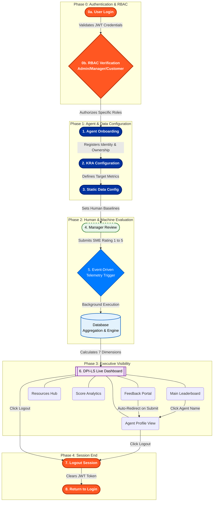

<div align="center">

# DPI-LS Digital FTE Performance Index for Life Sciences

<p align="center">A comprehensive enterprise-grade solution by Intelligenz IT.</p>

<p align="center">
<a href="https://intelligenzit.com/"></a>
<a href="https://www.linkedin.com/company/intelligenz-it/"></a>
</p>

<p align="center">
<a href="#quick-start"><b>Quick Start</b></a> • <a href="./dpi_ls_business_architecture.md"><b>Architecture</b></a> • <a href="#dashboard"><b>Dashboard</b></a> • <a href="#the-7-dimensions"><b>The 7 Dimensions</b></a>
</p>

</div>

---

Prepared by Intelligenz IT AI & Automation Center of Excellence

## Quick Start

```bash
uv run uvicorn api.app:app --host 127.0.0.1 --port 8000
```
- **Onboarding:** http://127.0.0.1:8000/widget/onboarding.html
- **Dashboard:** http://127.0.0.1:8000/widget/demo.html
- **API Docs:** http://127.0.0.1:8000/docs

## Business Problem

When companies deploy AI to handle important work — like processing invoices, analyzing medical documents, or monitoring cloud costs — they need to know if the AI is doing a good job, working safely, and actually saving money. The problem is a lack of real-time visibility, governance, and quantifiable metrics on AI behavior.

## Solution Overview

**DPI-LS answers that question.** Instead of just hoping the AI works, DPI-LS automatically measures 7 critical performance areas and gives you a single, easy-to-understand score out of 100. It combines hard data from the AI's operations with subjective feedback from human managers to ensure the AI is truly adding value. 

**We measure Trust, not just Productivity.** By bridging HR, Business, and Compliance, DPI-LS helps organizations manage AI as a workforce — with full lifecycle governance and accountability.

## Recent Technical Upgrades (Frontend & Widget UI)

The widget platform has undergone a major **UI/UX and Technical Architecture Overhaul** to transition the application into a dark-themed, enterprise-ready dashboard with enhanced AI features.

### 1. Universal Layout & Routing
* **Dark Theme Standard**: Deprecated old color schemes in favor of a unified `#090d16` and `#0f172a` deep-space dark theme across all 7 views.
* **Unified Sidebar Navigation**: Reordered and strictly locked the sidebar navigation exactly as requested: `Dashboard` (Default Landing) -> `Onboard Agent` -> `Configuration` -> `Rating` -> `Profile` -> `Resources` -> `Sign Out`.
* **Login Tracker**: Embedded a persistent session tracker securely bound to `localStorage` during the `/widget/admin-login.html` authentication step. The `Session Started` badge renders dynamically in the header of all pages.

### 2. Intelligent Search & Autocomplete
* **Global Search Component**: Added a persistent top header with a search bar.
* **Live Autocomplete**: Injected a vanilla JS event-driven listener to the search bar. Typing instantly triggers an async fetch to `/api/ratings`, filtering and categorizing results live into `Agents` and `Metrics`.
* **Deep Linking**: Clickable autocomplete dropdown results route the user instantly to heavily parameterized URLs (e.g. `agent-profile.html?id=chandra-finops` or `demo.html?filter=risk`).

### 3. Native AI Chatbot Integration
* **Floating Assistant**: Injected an absolute-positioned floating action button (FAB) bound to a slide-up conversational interface.
* **Context-Aware Responses**: Bound to a simulated logic engine that provides immediate explanations for complex topics like the DPI-LS algorithm, Risk thresholds, and Weightages.
* **Typewriter Effect**: AI responses use a `setInterval`-based streaming character renderer to simulate natural language generation block-by-block.

### 4. Dynamic Metric Visualization
* **Conditional Score Rendering**: Re-wrote the inner polling loop in `dpi-ls.js` to dynamically inject inline CSS colors to the final DPI-LS score cells.
  * Score >= 80: **Green**
  * Score 51 - 79: **Yellow**
  * Score <= 50: **Red**
* **Strict Configuration Constraints**: Overhauled the `agent-config.html` UI to accept all 7 specific dimensions (P, Q, E, G, R, C, V). Added hard validation logic ensuring weight distribution equals exactly 100% prior to dispatching `Promise.all` fetch payloads to the backend.

### 5. Backend Alignment
* **Test Suite Modernization**: Re-wired `tests/test_widget_serving.py` to correctly test the new requirement that unauthenticated root (`/`) visitors are routed strictly to `admin-login.html` instead of the Dashboard.

## Architecture

The complete end-to-end workflow follows this architecture:



For detailed architecture diagrams and the event-driven workflow, please refer to the dedicated document:
[DPI-LS Business Architecture Document](./dpi_ls_business_architecture.md)

## Dashboard

All results flow into the live Dashboard, which serves as your central command center. The Dashboard contains:
- **Leaderboard**: All agents ranked by score.
- **Resources**: Operational manuals and guides.
- **DPI-LS Score Details**: Scoring methodology.
- **Customer Feedback Portal**: End-user feedback forms.

[Dashboard Reference](./docs/dashboard.png)

## KPIs

- **Score Range**: 0-100 arithmetic mean of all dimensions.
- **Exceptional**: 85-100
- **Strong**: 70-84
- **Needs Optimization**: 50-69
- **Underperforming**: Below 50

## The 7 Dimensions

Every AI agent is evaluated across these 7 areas:

| Dimension | What It Measures | In Simple Terms |
|-----------|-----------------|-----------------|
| **P** — Productivity | How much work the AI completes compared to a human | "Is the AI faster than a person?" |
| **Q** — Quality | Accuracy, consistency, and hallucination rate of AI outputs | "Is the AI giving correct answers?" |
| **E** — Execution | Success rate of all AI tasks and tool calls | "Is the AI completing tasks without errors?" |
| **G** — Governance | Policy compliance — PII leaks, unauthorized access | "Is the AI following the rules?" |
| **R** — Risk | Frequency and severity of incidents and exceptions | "Is the AI causing any problems?" |
| **V** — Validation | Whether outputs are properly structured | "Is the AI producing well-formatted results?" |
| **C** — Cost | AI cost per output compared to human cost per output | "Is the AI saving us money?" |

## AI Agent Model

The engine is **agent-agnostic** — it consumes a canonical `AgentObservation` schema and never imports an agent framework. It supports:
- OpenAI Agents SDK
- LangGraph, LangChain, CrewAI, AutoGen, LlamaIndex
- Raw OpenAI / Anthropic
- Any custom framework

## Security & Governance

If the AI fails on Governance (G), Risk (R), or Validation (V), the system automatically caps the score and flags the agent as **Unsafe** — no matter how well it performs in other areas. A single PII leak will trigger this safety gate.

## Deployment

Deploy using Docker Compose for the full observability stack:
```bash
docker compose up -d
```

## References

- [Whitepaper](./docs/whitepaper.pdf)
- [Design Rationale](./CLAUDE.md)
- [License](./LICENSE)


## About Intelligenz IT

Intelligenz IT is a global enterprise transformation partner specializing in:

- AI & Automation
- Microsoft Copilot
- Copilot Studio
- Azure OpenAI
- SAP
- Salesforce
- ServiceNow
- Cloud Transformation
- Data Engineering
- Analytics
- Enterprise Architecture

Website: https://intelligenzit.com/  
LinkedIn: https://www.linkedin.com/company/intelligenz-it/

---

© Intelligenz IT.
All Rights Reserved.

For inquiries:
https://intelligenzit.com/

LinkedIn:
https://www.linkedin.com/company/intelligenz-it/
