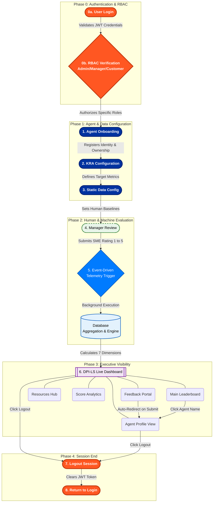

# Business Requirements Document (BRD) - DPI-LS

| | |
| --- | --- |
| **Purpose** | Stakeholder / high-level understanding and business requirements for the complete DPI-LS (Digital FTE Performance Index for Life Sciences) platform. |
| **Scope** | End-to-end AI agent evaluation model (7 Dimensions: P, Q, E, G, R, V, C), telemetry integrations, compliance gates, governance, executive dashboard visibility, and core engine foundations. |
| **Maturity Model** | L1 Observe &rarr; L2 Evaluate &rarr; L3 Govern &rarr; L4 Trust & Scale. |
| **Status** | Final BRD baseline for executive review; detailed technical design follows BRD approval. |
## Table of Contents
1. [What is DPI-LS and Why is it needed?](#1-what-is-dpi-ls-and-why-is-it-needed)
2. [Business Problem & Solution Overview](#2-business-problem--solution-overview)
3. [Scope & Objectives: The 7 Dimensions](#3-scope--objectives-the-7-dimensions)
4. [End-to-End Business Architecture Workflow](#4-end-to-end-business-architecture-workflow)
5. [System Requirements & Scoring Logic](#5-system-requirements--scoring-logic)
6. [Technical & Deployment Requirements](#6-technical--deployment-requirements)

---

## 1. What is DPI-LS and Why is it needed?

**Product Name:** Digital FTE Performance Index for Life Sciences (DPI-LS)
**Prepared by:** Intelligenz IT AI & Automation Center of Excellence

### 1.1 What is DPI-LS?
DPI-LS is an enterprise-grade AI governance and evaluation platform. It is designed to score **any AI agent or Digital Worker** in real-time on a 0–100 index across 7 critical performance dimensions (Productivity, Quality, Execution, Governance, Risk, Validation, and Cost). It operates as an agent-agnostic engine that consumes observation telemetry to provide an integrated dashboard for business leaders, bridging HR, Business, and Compliance.

### 1.2 Why is it needed?
As life sciences organizations deploy AI to handle critical business workflows (such as processing invoices, analyzing medical documents, or monitoring operations), traditional software monitoring is no longer sufficient. Organizations need DPI-LS because:
*   **Unsupervised AI is Risky:** Companies need hard compliance gates to ensure AI agents do not leak PII, hallucinate dangerous conclusions, or bypass authorization.
*   **ROI Must be Quantified:** There is a need to mathematically prove if an AI agent is actually saving time and money compared to a human worker doing the same job.
*   **Trust Through Visibility:** Business executives need a single, easy-to-understand "credit score" for their AI workforce rather than digging through complex engineering logs.
*   **Human-in-the-Loop Accountability:** It assigns human owners to AI processes, combining cold operational data with subjective feedback from human managers to measure true value.

---

## 2. Business Problem & Solution Overview

### 2.1 The Business Problem
When companies deploy AI to handle critical workflows (e.g., processing invoices, analyzing medical documents, monitoring cloud costs), they face significant challenges:
*   **Lack of Visibility:** It is difficult to know if the AI is performing well or failing silently.
*   **Absence of Governance:** Ensuring the AI operates safely and complies with enterprise policies (e.g., PII protection) is complex.
*   **Unclear ROI:** Organizations struggle to quantify if the AI is actually saving time and money compared to human workers.
*   **Trust Deficit:** A lack of quantifiable metrics makes it hard for business leaders to trust AI as a digital workforce.

### 2.2 The DPI-LS Solution
DPI-LS solves these problems by providing an automated, agent-agnostic evaluation engine. 
*   **Holistic Measurement:** Automatically measures 7 critical performance areas.
*   **Unified Scoring:** Outputs a single, easy-to-understand score out of 100.
*   **Human-in-the-Loop:** Combines hard operational telemetry with subjective feedback from human managers.
*   **Lifecycle Governance:** Bridges HR, Business, and Compliance to manage AI as an accountable digital workforce.

---

## 3. Scope & Objectives: The 7 Dimensions

DPI-LS evaluates every AI agent across the following 7 dimensions (P, Q, E, G, R, V, C):

*   **P — Productivity:** 
    *   *Measures:* How much work the AI completes compared to a human baseline.
    *   *Question:* "Is the AI faster than a person?"
*   **Q — Quality:** 
    *   *Measures:* Accuracy, consistency, and hallucination rate of AI outputs (typically via LLM evaluators).
    *   *Question:* "Is the AI giving correct answers?"
*   **E — Execution:** 
    *   *Measures:* The success rate of all AI tasks and tool calls.
    *   *Question:* "Is the AI completing tasks without errors?"
*   **G — Governance:** 
    *   *Measures:* Policy compliance, including PII leaks, prompt injections, and unauthorized access.
    *   *Question:* "Is the AI following the rules?"
*   **R — Risk:** 
    *   *Measures:* The frequency and severity of incidents and exceptions.
    *   *Question:* "Is the AI causing any problems?"
*   **V — Validation:** 
    *   *Measures:* Whether the outputs are properly structured (e.g., correct JSON, markdown tables).
    *   *Question:* "Is the AI producing well-formatted results?"
*   **C — Cost:** 
    *   *Measures:* The AI cost per output compared to the human cost per output.
    *   *Question:* "Is the AI saving us money?"

---

## 4. End-to-End Business Architecture Workflow

The complete end-to-end workflow is event-driven and follows this structured architecture:

### Architecture Diagram

### Workflow Phases

*   **Phase 0: Secure Login**
    *   First, users log into the system securely. 
    *   The platform checks their role to see if they are an Admin, Manager, or Customer. This ensures that only authorized people can add new agents, rate their own agents, or submit feedback, keeping the entire system safe and accountable.
*   **Phase 1: Agent Onboarding**
    *   Once logged in, an Admin registers a new AI Digital Worker into the system. 
    *   This step is crucial because it assigns real human owners (a Business Owner, Technical Owner, and Manager) to the AI, ensuring it never operates in the dark without human supervision.
*   **Phase 2: Setting Goals**
    *   Next, the Admin defines the specific goals (Key Result Areas) the AI needs to achieve. 
    *   By setting target metrics and weighing their importance, the system learns exactly what success looks like for that specific business process.
*   **Phase 3: Adding Human Benchmarks**
    *   The system then brings in real-world data, like how much a human costs or how fast a human works. 
    *   By having this baseline, the platform can mathematically prove if the AI is actually saving time and money compared to a human worker.
*   **Phase 4: Manager Approval**
    *   After the AI has been running, its assigned human manager logs in to rate its performance on a scale of 1 to 5 and leaves comments. 
    *   This ensures that cold, hard data is always balanced with real human feedback.
*   **Phase 5: The Automated Engine**
    *   The moment the manager submits their review, it triggers the backend engine. 
    *   Without anyone having to click another button, the system automatically gathers all the metrics, runs deep evaluations across our monitoring tools, and computes the final score in the background.
*   **Phase 6: The Executive Dashboard**
    *   Finally, all these calculations are pushed to a live, easy-to-read web dashboard. 
    *   Here, executives can view a leaderboard ranking all their AI agents. From the dashboard, they can click on any agent to open its detailed profile, read documentation in the resources hub, or drill down into how the metrics were calculated. End-users can also submit direct feedback, which automatically updates the agent's profile and drives continuous improvement.
*   **Phase 7: Secure Logout (Session Termination)**
    *   When a user finishes their tasks on the Dashboard or Agent Profile, they can securely click **Logout**. 
    *   This destroys their session token and returns them safely to the login screen, completing the full lifecycle and keeping the platform secure.

---

## 5. System Requirements & Scoring Logic

### 5.1 KPI Score Ranges
The final score is a weighted arithmetic mean of the 7 dimensions, scaled to 100.
*   **85–100:** Exceptional
*   **70–84:** Strong
*   **50–69:** Needs Optimization
*   **Below 50:** Underperforming

### 5.2 Security & Compliance Gates
DPI-LS enforces strict safety guardrails. If an AI agent fails on critical dimensions, the system intervenes:
*   **Hard Gates for G, R, V:** If Governance (G), Risk (R), or Validation (V) scores fall below predefined thresholds (e.g., a single PII leak).
*   **Action Taken:** The system automatically caps the agent's maximum score at **69** (Needs Optimization) and flags the agent as **Unsafe**, regardless of how well it performs in Productivity or Cost.
*   **Completeness Cap:** If an agent is missing critical telemetry data for G, R, or V, its score is capped until the data is provided, preventing artificially high scores from incomplete observability.

### 5.3 Agent Agnosticism
*   The scoring engine consumes a canonical `AgentObservation` schema.
*   It does not depend on any specific framework and supports OpenAI Agents, LangGraph, CrewAI, AutoGen, LlamaIndex, custom frameworks, and raw APIs.

---

## 6. Technical & Deployment Requirements

*   **Architecture Stack:** 
    *   Server: FastAPI + SQLAlchemy (Python 3.11+).
    *   Frontend Widget: Embeddable vanilla web components (`dpi-ls.js`).
    *   Integration: 2-line Python package (`dpi_ls`) for dropping into existing agent code.
*   **Deployment:** Docker Compose for the full observability stack (including telemetry sidecars like OpenTelemetry, Prometheus, and Tempo).
*   **Extensibility:** New agents or data sources can be onboarded via YAML field-mappings, generic webhooks, or custom Python adapters without altering the core scoring engine.
