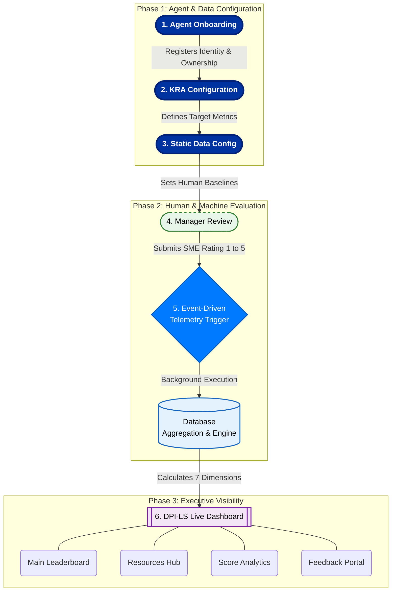

# DPI-LS: Business Architecture Workflow

This document outlines the end-to-end business architecture and event-driven workflow for the **Digital Performance Index for Life Sciences (DPI-LS)** system.

## Workflow Phases

### Phase 1: Agent Onboarding (Identity & Governance)
- **Action:** A new Digital Worker is registered into the system.
- **Business Value:** Establishes clear accountability by assigning a Business Owner, Technical Owner, and Manager. This ensures the AI is not a "black box" and has human oversight.

### Phase 2: KRA Configuration (Strategic Alignment)
- **Action:** Key Result Areas (KRAs) are defined with specific target values and weights.
- **Business Value:** Aligns the AI's operations with business goals. By weighting metrics (e.g., giving Accuracy an 85% weight), the scoring engine knows exactly what constitutes success or failure for this specific business process.

### Phase 3: Static Data Configuration (Benchmarking)
- **Action:** Baseline metrics, such as the `human_baseline`, are ingested from enterprise HR or Operations data.
- **Business Value:** Allows the system to calculate ROI and Efficiency. The AI's speed and cost are mathematically compared against these baselines to prove true business value.

### Phase 4: Manager Review (Subjective Evaluation)
- **Action:** The assigned human manager reviews the AI's performance for a specific period and submits a 1-5 rating and comments.
- **Business Value:** Ensures objective metrics are balanced with human SME (Subject Matter Expert) feedback. This feeds directly into the "Quality" dimension of the final score.

### Phase 5: Event-Driven Automation (The Engine)
- **Action:** Submitting the Manager Review acts as a trigger. The FastAPI backend automatically dispatches a background task (`test_agent.py`).
- **Business Value:** "Zero-Touch Scoring". The system dynamically pulls the baselines and weights defined in Phases 2 and 3, runs live evaluations across observability tools (Jaeger, Zipkin, DeepEval, etc.), and computes the scores without freezing the user's browser or requiring manual terminal commands.

### Phase 6: The Dashboard (Visualization & Action)
- **Action:** The computed scores are pushed to the live web interface.
- **Business Value:** Provides a single pane of glass for executives to monitor AI health.
  - **Dashboard:** The main leaderboard ranking all agents.
  - **Resources:** Central hub for AI operations manuals.
  - **DPI-LS Score:** Deep dive into how the metrics were calculated.
  - **Submit Customer Feedback:** Closes the loop by allowing end-users to provide feedback, driving continuous improvement.
