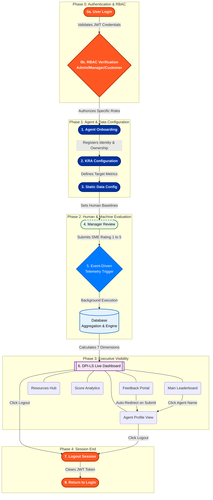

# DPI-LS: Business Architecture Workflow

This document outlines the end-to-end business architecture and event-driven workflow for the **Digital Performance Index for Life Sciences (DPI-LS)** system.

## Workflow Phases

### Phase 0: Secure Login
First, users log into the system securely. The platform checks their role to see if they are an Admin, Manager, or Customer. This ensures that only authorized people can add new agents, rate their own agents, or submit feedback, keeping the entire system safe and accountable.

### Phase 1: Agent Onboarding
Once logged in, an Admin registers a new AI Digital Worker into the system. This step is crucial because it assigns real human owners (a Business Owner, Technical Owner, and Manager) to the AI, ensuring it never operates in the dark without human supervision.

### Phase 2: Setting Goals
Next, the Admin defines the specific goals (Key Result Areas) the AI needs to achieve. By setting target metrics and weighing their importance, the system learns exactly what success looks like for that specific business process.

### Phase 3: Adding Human Benchmarks
The system then brings in real-world data, like how much a human costs or how fast a human works. By having this baseline, the platform can mathematically prove if the AI is actually saving time and money compared to a human worker.

### Phase 4: Manager Approval
After the AI has been running, its assigned human manager logs in to rate its performance on a scale of 1 to 5 and leaves comments. This ensures that cold, hard data is always balanced with real human feedback.

### Phase 5: The Automated Engine
The moment the manager submits their review, it triggers the backend engine. Without anyone having to click another button, the system automatically gathers all the metrics, runs deep evaluations across our monitoring tools, and computes the final score in the background.

### Phase 6: The Executive Dashboard
Finally, all these calculations are pushed to a live, easy-to-read web dashboard. Here, executives can view a leaderboard ranking all their AI agents. From the dashboard, they can click on any agent to open its detailed profile, read documentation in the resources hub, or drill down into how the metrics were calculated. End-users can also submit direct feedback, which automatically updates the agent's profile and drives continuous improvement.

### Phase 7: Secure Logout (Session Termination)
When a user finishes their tasks on the Dashboard or Agent Profile, they can securely click **Logout**. This destroys their session token and returns them safely to the login screen, completing the full lifecycle and keeping the platform secure.
